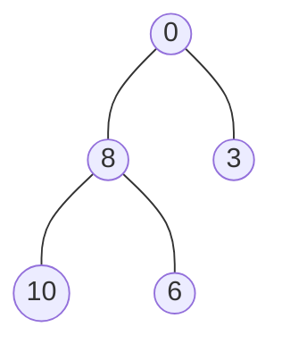
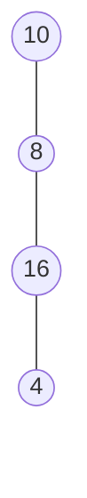
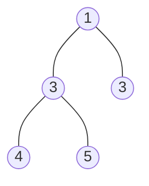

A node $n$ (except the root node) is connected by **at least** one other node $p$ where $p$ is the parent of $n$
 
 ### Terminology
##### Root 
The node at the top 
##### Depth
The number of edges from a specific node to the root node
###### Height
The number of nodes from the deepest leaf node to the root node
##### Internal (Nodes)
A node that has at least one child
- All nodes except the root and the leaf
##### Edges
Connections between nodes in the tree
##### Leaf/External (Nodes)
The most bottom nodes

## Binary Tree
A special type of tree where all nodes in the tree have **maximum 2 child nodes***
- These nodes are named *left* and *right*
### Properties
- $n$ nodes $n-1$ edges
- for every level $k$ where $k\geq1$, there are no more than $2^{k-1}$ nodes on level $k$
	- a binary tree with $k$ edges has no more than $2^k -1$ nodes
### Types
#### Full Binary Tree
A binary tree where **every node** has 0 or 2 children. 
* left or right doesn't matter

#### Skewed Binary Tree

#### Degenerate/Pathological Tree
Every internal in the tree has **one child**
- They performance wise the same as linked-lists

##### Skewed Binary Tree
A type of Degenerate/Pathological Tree where tree is dominated by either *left* or *right* nodes
1. Left-Skewed
2. Right-Skewed

#### Complete Binary Tree
All levels except the last are filled and **they are as *left* as possible**
- At depth $d$, the number of nodes is $2^d$

#### Perfect Binary Tree
